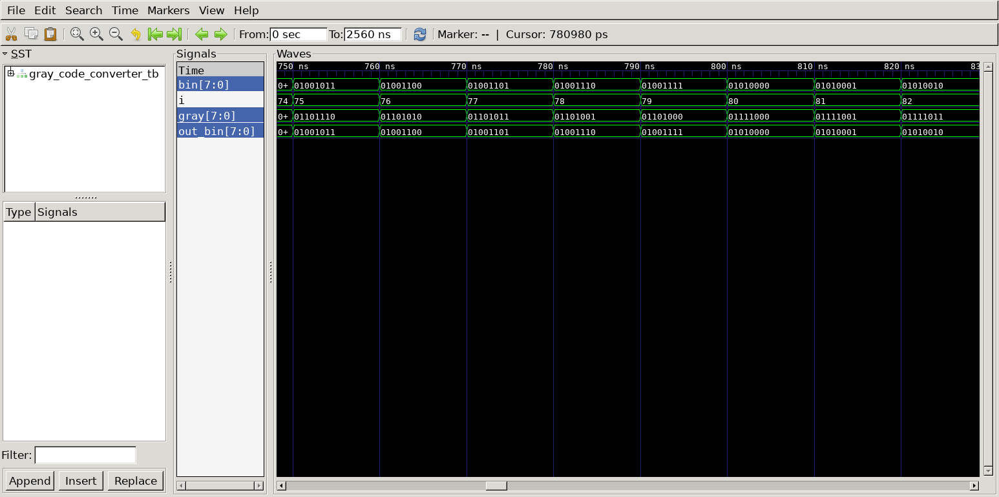

# Gray Code Converter
## Operation Principle
- Binary -> Gray
	- G[N-1] = B[N-1]
	- G[i] = B[i+1] ^ B[i]

- Gray -> Binary
	- B[N-1] = G[N-1]
	- B[i] = B[i+1] ^ G[i]	(N-1 > i >= 0)

## Verilog Code
### DUT
```Verilog
	module bin_to_gray
	#(
		parameter bit_size = 8
	)
	(
		input    [bit_size-1:0]   bin,
		output   [bit_size-1:0]   gray
	);
	
		assign gray = (bin >> 1) ^ bin;
	
	endmodule
	
	module gray_to_bin
	#(
		parameter bit_size = 8
	)
	(
		input    [bit_size-1:0]   gray,
		output   [bit_size-1:0]   bin
	);
	
		assign bin = (bin >> 1) ^ gray;
	
	endmodule
```

### Testbench
```Verilog
	// --------------------------------------------------
	//	Define Global Variables
	// --------------------------------------------------
	`define	CLKFREQ		100		// Clock Freq. (Unit: MHz)
	`define	SIMCYCLE	`NVEC	// Sim. Cycles
	`define NVEC		2**8		// # of Test Vector
	
	// --------------------------------------------------
	//	Includes
	// --------------------------------------------------
	`include	"gray_code_converter.v"
	
	module gray_code_converter_tb;
	// --------------------------------------------------
	//	DUT Signals & Instantiate
	// --------------------------------------------------
		reg    [bit_size-1:0]   bin;
		wire   [bit_size-1:0]   out_bin;
		wire   [bit_size-1:0]   gray;
	
		parameter bit_size = 8;
	
		bin_to_gray
		#(
			.bit_size			(bit_size			)
		)
		u_bin_to_gray(
			.bin				(bin				),
			.gray				(gray				)
		);
	
		gray_to_bin
		#(
			.bit_size			(bit_size			)
		)
		u_gray_to_bin(
			.gray				(gray				),
			.bin				(out_bin			)
		);
	
	
	
	
	// --------------------------------------------------
	//	Tasks
	// --------------------------------------------------
		task init;
			begin
				bin		= 0;
			end
		endtask
	
	// --------------------------------------------------
	//	Test Stimulus
	// --------------------------------------------------
		integer		i;
		initial begin
			init();
	
			for (i=0; i<`SIMCYCLE; i++) begin
				bin = i;
				#(1000/`CLKFREQ);
			end
		end
	
	// --------------------------------------------------
	//	Dump VCD
	// --------------------------------------------------
		reg	[8*32-1:0]	vcd_file;
		initial begin
			if ($value$plusargs("vcd_file=%s", vcd_file)) begin
				$dumpfile(vcd_file);
				$dumpvars;
			end else begin
				$dumpfile("gray_code_converter_tb.vcd");
				$dumpvars;
			end
		end
	
	endmodule
```

## Simulation Result
- Clock Period = 10ns
- bin -> gray -> out_bin
- bin = out_bin


