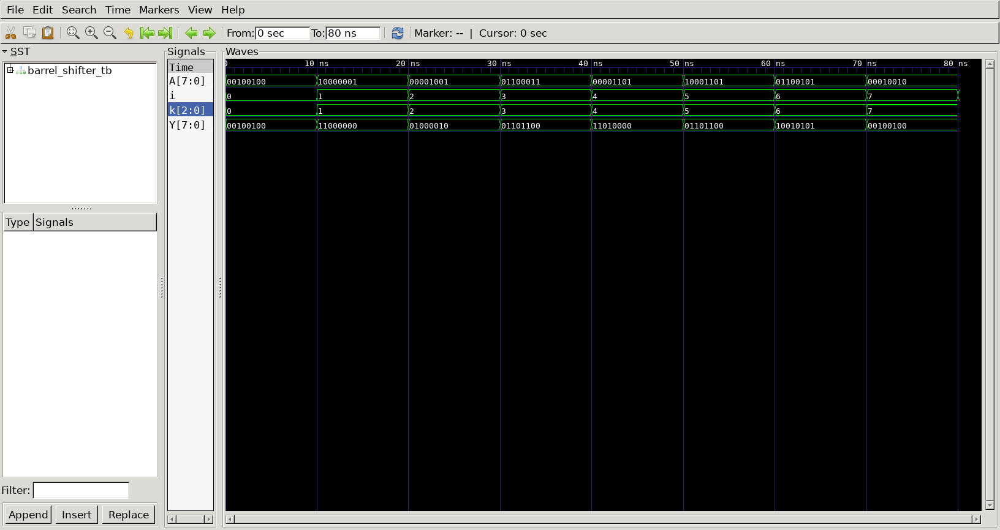

# Barrel Shifter
## Operation Principle
- 8-bit barrel Shifter using mux2
	- rotate right
		- k[2:0] = rotate amount

## Verilog Code
### DUT
```Verilog
module barrel_shifter
(
	input  [2:0] k,
	input  [7:0] A,
	output [7:0] Y
);
	
	wire [7:0] w, o;

	genvar j;
	generate
		for(j=0; j<4; j=j+1) begin
			mux2
			u_mux2_0(
				.k					(k[2]				),
				.in0				(A[j]				),
				.in1				(A[j+4]				),
				.mux_out			(o[j]				)
			);
	
			mux2
			u_mux2_1(
				.k					(k[2]				),
				.in0				(A[j+4]				),
				.in1				(A[j]				),
				.mux_out			(o[j+4]				)
			);
		end
	endgenerate

	genvar p;
	generate
		for(p=0; p<6; p=p+1) begin : mux_loop
			mux2
			u_mux2(
				.k					(k[1]				),
				.in0				(o[p]				),
				.in1				(o[p+2]				),
				.mux_out			(w[p]				)
			);

		end
	endgenerate

	mux2
	u_mux2_3(
		.k					(k[1]				),
		.in0				(o[6]				),
		.in1				(o[0]				),
		.mux_out			(w[6]				)
	);

	mux2
	u_mux2_4(
		.k					(k[1]				),
		.in0				(o[7]				),
		.in1				(o[1]				),
		.mux_out			(w[7]				)
	);
	genvar i;
	generate
		for(i=0; i<7; i=i+1) begin
			mux2
			u_mux2_5(
				.k					(k[0]				),
				.in0				(w[i]				),
				.in1				(w[i+1]				),
				.mux_out			(Y[i]				)
			);
		end
	endgenerate

	mux2
	u_mux2_6(
		.k					(k[0]				),
		.in0				(w[7]				),
		.in1				(w[0]				),
		.mux_out			(Y[7]				)
	);

endmodule

module mux2
(
	input	   k,
	input	   in0,
	input	   in1,
	output reg mux_out
);

	always @ (*) begin
		case(k)
			0 : mux_out = in0;
			1 : mux_out = in1;
		endcase
	end

endmodule
```

### Testbench
```Verilog
// --------------------------------------------------
//	Define Global Variables
// --------------------------------------------------
`define	CLKFREQ		100		// Clock Freq. (Unit: MHz)
`define	SIMCYCLE	`NVEC	// Sim. Cycles
`define NVEC		8		// # of Test Vector

// --------------------------------------------------
//	Includes
// --------------------------------------------------
`include	"barrel_shifter.v"

module barrel_shifter_tb;
// --------------------------------------------------
//	DUT Signals & Instantiate
// --------------------------------------------------
	reg  [2:0] k;
	reg  [7:0] A;
	wire [7:0] Y;

	barrel_shifter
	u_barrel_shifter(
		.k					(k					),
		.A					(A					),
		.Y					(Y					)
	);

// --------------------------------------------------
//	Tasks
// --------------------------------------------------
	task init;
		begin
			k = 0;
			A = 0;
		end
	endtask

// --------------------------------------------------
//	Test Stimulus
// --------------------------------------------------
	integer		i, j;
	initial begin
		init();

		for (i=0; i<`SIMCYCLE; i++) begin
			k = i;
			A = $urandom;
			#(1000/`CLKFREQ);
		end
		$finish;
	end

// --------------------------------------------------
//	Dump VCD
// --------------------------------------------------
	reg	[8*32-1:0]	vcd_file;
	initial begin
		if ($value$plusargs("vcd_file=%s", vcd_file)) begin
			$dumpfile(vcd_file);
			$dumpvars;
		end else begin
			$dumpfile("barrel_shifter_tb.vcd");
			$dumpvars;
		end
	end

endmodule
```

## Simulation Result
- result : (0 ~ 7) right rotate


