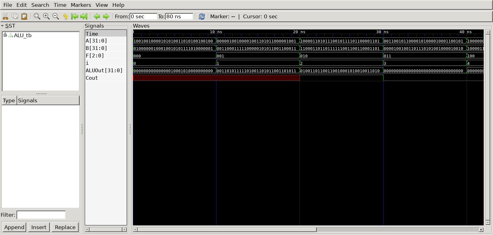

# Arithmetic Logic Unit (ALU)
## Operation Principle
|F[2:0]|Function|
|:---:|:---:|
|000|A & B|
|001|A \| B|
|010|A + B|
|011|not used|
|100|A & ~B|
|101|A | ~B|
|110|A - B|
|111|SLT|
## verilog Code
### DUT
```verilog
module ALU
(
	input		 [2:0]  F,
	input		 [31:0] A,
	input		 [31:0] B,
	output reg	 [31:0] ALUOut,
	output reg			Cout
);

	always @ (*) begin
		case(F)
			0 : ALUOut = A & B;
			1 : ALUOut = A | B;
			2 : {Cout, ALUOut} = A + B;
			4 : ALUOut = A & ~B;
			5 : ALUOut = A | ~B;
			6 : ALUOut = A - B;
			7 : ALUOut = A < B;
			default : {Cout, ALUOut} = 0;
		endcase
	end
endmodule
```

### Testbench
```verilog
// --------------------------------------------------
//	Define Global Variables
// --------------------------------------------------
`define	CLKFREQ		100		// Clock Freq. (Unit: MHz)
`define	SIMCYCLE	`NVEC	// Sim. Cycles
`define NVEC		8		// # of Test Vector

// --------------------------------------------------
//	Includes
// --------------------------------------------------
`include	"ALU.v"

module ALU_tb;
// --------------------------------------------------
//	DUT Signals & Instantiate
// --------------------------------------------------
	reg		 [2:0]  F;
	reg		 [31:0] A;
	reg		 [31:0] B;
	wire	 [31:0] ALUOut;
	wire			Cout;

	ALU
	u_ALU(
		.F					(F					),
		.A					(A					),
		.B					(B					),
		.ALUOut				(ALUOut				),
		.Cout				(Cout				)
	);


// --------------------------------------------------
//	Tasks
// --------------------------------------------------
	reg [8*32-1:0] taskState;

	task init;
		begin
			F = 0;
			A = 0;
			B = 0;
		end
	endtask

// --------------------------------------------------
//	Test Stimulus
// --------------------------------------------------
	integer		i, j;
	initial begin
		init();

		for (i=0; i<`SIMCYCLE; i++) begin
			F = i;
			A = $urandom;
			B = $urandom;
			#(1000/`CLKFREQ);
		end
		$finish;
	end

// --------------------------------------------------
//	Dump VCD
// --------------------------------------------------
	reg	[8*32-1:0]	vcd_file;
	initial begin
		if ($value$plusargs("vcd_file=%s", vcd_file)) begin
			$dumpfile(vcd_file);
			$dumpvars;
		end else begin
			$dumpfile("ALU_tb.vcd");
			$dumpvars;
		end
	end
endmodule
```

## Simulation Result
- Clock Period = 10ns




