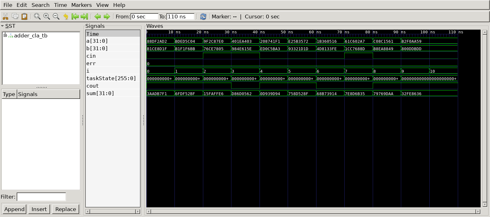

# Carry-Lookahead Adder
## Operation Principle
- 32\-bit CLA with 4\-bit blocks
- 4\-bit block
	- bitwise PG Logic
		- P = A ^ B
		- G = A & B
	- Group PG Logic
		- G[i:j] = G[i] + P[i](G[i-1] + p[i-1](G[i-2] + P[i-2] * G[j])
		- P[i:j] = P[i] & P[i-1] & P[i-2] & P[j]
		- C[i] = G[i:j] + P[i:j] * C[j-1]
	- Sum Logic
		- sum = A ^ B ^ C
## Verilog Code
### DUT
```Verilog
module adder_cla
(
	input  [31:0] a,
	input  [31:0] b,
	input         cin,
	output        cout,
	output [31:0] sum
);

	wire [8:0] co;
	
	assign co[0] = cin;

	genvar i;
	generate
		for(i=0; i<8; i=i+1) begin : adder_cla_loop
			adder_cla_4bit
			u_adder_cla_4bit(
				.a					(a[4*i+3:4*i]		),
				.b					(b[4*i+3:4*i]		),
				.cin				(co[i]				),
				.cout				(co[i+1]			),
				.sum				(sum[4*i+3:4*i]		)
			);
		end
	endgenerate

	assign cout = co[8];

endmodule
	
module adder_cla_4bit
(
	input  [3:0] a,
	input  [3:0] b,
	input        cin,
	output       cout,
	output [3:0] sum
);

	wire [3:0] P, G, C;
	wire out_P, out_G;

	// bitwise PG Logic
	assign P = a ^ b;
	assign G = a & b;

	// Group PG Logic
	assign C[0] = cin;
	assign C[1] = G[0] | (P[0] & C[0]);
	assign C[2] = G[1] | (P[1] & C[1]);
	assign C[3] = G[2] | (P[2] & C[2]);
	assign cout = G[3] | P[3] & C[3];

	// Sum LogiC
	assign sum = a ^ b ^ C;

endmodule
```

## Testbench
```Verilog
// --------------------------------------------------
//	Define Global Variables
// --------------------------------------------------
`define	CLKFREQ		100		// Clock Freq. (Unit: MHz)
`define	SIMCYCLE	`NVEC	// Sim. Cycles
`define NVEC		10		// # of Test Vector
`define BW_DATA		32		// Bitwidth of ~~

// --------------------------------------------------
//	Includes
// --------------------------------------------------
`include	"adder_cla.v"

module adder_cla_tb;

// --------------------------------------------------
//	DUT Signals & Instantiate
// --------------------------------------------------
	reg  [31:0] a;
	reg  [31:0] b;
	reg         cin;
	wire        cout;
	wire [31:0] sum;

	adder_cla
	u_adder_cla(
		.a					(a					),
		.b					(b					),
		.cin				(cin				),
		.cout				(cout				),
		.sum				(sum				)
	);


// --------------------------------------------------
//	Test Vector Configuration
// --------------------------------------------------
	reg		[`BW_DATA-1:0]	vo_s[0:`NVEC-1];
	reg						vo_c[0:`NVEC-1];
	reg		[`BW_DATA-1:0]	vi_a[0:`NVEC-1];
	reg		[`BW_DATA-1:0]	vi_b[0:`NVEC-1];
	reg						vi_c[0:`NVEC-1];

	initial begin
		$readmemb("/home/imh522/utils/scripts/vec/o_s.vec",			vo_s);
		$readmemb("/home/imh522/utils/scripts/vec/o_c.vec",			vo_c);
		$readmemb("/home/imh522/utils/scripts/vec/i_a.vec",			vi_a);
		$readmemb("/home/imh522/utils/scripts/vec/i_b.vec",			vi_b);
		$readmemb("/home/imh522/utils/scripts/vec/i_c.vec",			vi_c);
	end

// --------------------------------------------------
//	Tasks
// --------------------------------------------------
	reg		 [8*32-1:0] taskState;
	integer				err = 0;

	task init;
		begin
			a = 0;
			b = 0;
			cin = 0;
		end
	endtask

	task vecInsert;
		input	[$clog2(`NVEC)-1:0]	i;
		begin
			$sformat(taskState,	"VEC[%3d]", i);
			a				= vi_a[i];
			b				= vi_b[i];
			cin				= vi_c[i];
		end
	endtask

	task vecVerify;
		input	[$clog2(`NVEC)-1:0]	i;
		begin
			#(0.1*1000/`CLKFREQ);
			if (sum				!= vo_s[i]) begin $display("[Idx: %3d] Mismatched sum", i); end
			if (cout			!= vo_c[i]) begin $display("[Idx: %3d] Mismatched cout", i); end
			if ((sum != vo_s[i]) || (cout != vo_c[i])) begin err++; end
			#(0.9*1000/`CLKFREQ);
		end
	endtask
// --------------------------------------------------
//	Test Stimulus
// --------------------------------------------------
	integer		i, j;
	initial begin
		init();

		for (i=0; i<`SIMCYCLE; i++) begin
			vecInsert(i);
			vecVerify(i);
		end
		#(1000/`CLKFREQ);
		$finish;
	end

// --------------------------------------------------
//	Dump VCD
// --------------------------------------------------
	reg	[8*32-1:0]	vcd_file;
	initial begin
		if ($value$plusargs("vcd_file=%s", vcd_file)) begin
			$dumpfile(vcd_file);
			$dumpvars;
		end else begin
			$dumpfile("adder_cla_tb.vcd");
			$dumpvars;
		end
	end

endmodule
```

## Simulation Result
- Clock Period = 10ns
- err = 0 -> simulation result = testvector result 



