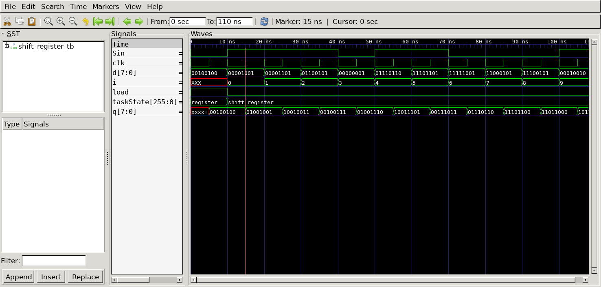

# Shift Register
## Operation Principle
 - When Load = 1, acts as a normal 8-bit Register
 	- parallel-to-serial converter : D to Sout
 - When Load = 0, acts as a shift Register
 	- Serial-to-parallel converter : Sin to Q


## Verilog Code
### DUT
```Verilog
module shift_register
#(
	parameter bit_size = 8
)
(
	input 				  clk,
	input 				  load,
	input 				  Sin,
	input  [bit_size-1:0] d,
	output [bit_size-1:0] q
);

	mux_dff
	u_mux_dff(
		.clk				(clk				),
		.load				(load				),
		.in0				(Sin				),
		.in1				(d[0]				),
		.q					(q[0]				)
	);

	genvar i;
	generate
		for (i=1; i<bit_size; i=i+1) begin : shift_register_block
			mux_dff
			u_mux_dff(
				.clk				(clk				),
				.load				(load				),
				.in0				(q[i-1]				),
				.in1				(d[i]				),
				.q					(q[i]				)
			);
		end
	endgenerate

endmodule

module mux_dff
(
	input clk,
	input load,
	input in0,
	input in1,
	output reg q
);

	reg mux_out;

	always @ (*) begin
		case(load)
			0 : mux_out = in0;
			1 : mux_out = in1;
		endcase
	end

	always @ (posedge clk) begin
		q <= mux_out;
	end
endmodule
```

## Testbench
```Verilog
// --------------------------------------------------
//	Define Global Variables
// --------------------------------------------------
`define	CLKFREQ		100		// Clock Freq. (Unit: MHz)
`define	SIMCYCLE	`NVEC	// Sim. Cycles
`define NVEC		10		// # of Test Vector

// --------------------------------------------------
//	Includes
// --------------------------------------------------
`include	"shift_register.v"

module shift_register_tb;
// --------------------------------------------------
//	DUT Signals & Instantiate
// --------------------------------------------------
	parameter bit_size = 8;

	reg 				  clk;
	reg 				  load;
	reg 				  Sin;
	reg  [bit_size-1:0] d;
	wire [bit_size-1:0] q;

	shift_register
	#(
		.bit_size			(bit_size			)
	)
	u_shift_register(
		.clk				(clk				),
		.load				(load				),
		.Sin				(Sin				),
		.d					(d					),
		.q					(q					)
	);

// --------------------------------------------------
//	Tasks
// --------------------------------------------------
	reg [8*32-1:0] taskState;

	task init;
		begin
			clk = 0;
			load = 0;
			Sin = 0;
			d = 0;
		end
	endtask

	task loadcycle;
		input [9:0] n;
		begin
			taskState = "register";
			load = 1;
			d = $urandom;
			#(1000/`CLKFREQ);
			load = 0;
			taskState  = "shift register";
		end
	endtask

// --------------------------------------------------
//	clock 
// --------------------------------------------------
	always #(500/`CLKFREQ) clk = ~clk;

// --------------------------------------------------
//	Test Stimulus
// --------------------------------------------------
	integer		i, j;
	initial begin
		init();
		loadcycle(10);

		for (i=0; i<`SIMCYCLE; i++) begin
			Sin  = $urandom;
			d	 = $urandom;
			#(1000/`CLKFREQ);
		end
		$finish;
	end

// --------------------------------------------------
//	Dump VCD
// --------------------------------------------------
	reg	[8*32-1:0]	vcd_file;
	initial begin
		if ($value$plusargs("vcd_file=%s", vcd_file)) begin
			$dumpfile(vcd_file);
			$dumpvars;
		end else begin
			$dumpfile("shift_register_tb.vcd");
			$dumpvars;
		end
	end

endmodule
```

## Simulation Result
- Clock Period  = 10ns
- Load = 1 -> 8-bit Register
- load = 0 -> shift register



