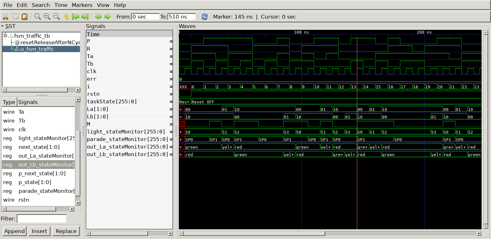

# FSM : Traffic Light Controller
## Operation Principle
- Lights FSM & Parade Mode FSM


## Verilog Code
### DUT
```verilog
module fsm_traffic
(
	input clk,
	input rstn,
	input Ta,
	input Tb,
	input P,
	input R,
	output reg  [1:0] La,
	output reg	[1:0] Lb
);

	localparam S0 = 0;
	localparam S1 = 1;
	localparam S2 = 2;
	localparam S3 = 3;
	localparam SP0 = 0;
	localparam SP1 = 1;
	
	parameter green = 0, yellow = 1, red = 2;

	wire M;
	reg [1:0] state, next_state;
	reg p_state, p_next_state;

	always @ (*) begin
		case(p_state)
			SP0 : p_next_state = P ? SP1 : SP0;
			SP1 : p_next_state = R ? SP0 : SP1;
		endcase

		case(state)
			S0 : next_state = Ta ? S0 : S1;
			S1 : next_state = S2;
			S2 : next_state = (M | Tb) ? S2 : S3;
			S3 : next_state = S0;
		endcase
	end

	always @ (posedge clk) begin
		if(!rstn) begin
			state <= S0;
			p_state <= SP0;
		end else begin
			state <= next_state;
			p_state <= p_next_state;
		end
	end

	assign M = (p_state == SP1);

	always @ (*) begin
		case(state)
			S0 : begin
				La = green;
				Lb = red;
			end
			S1 : begin
				La = yellow;
				Lb = red;
			end
			S2 : begin
				La = red;
				Lb = green;
			end
			S3 : begin
				La = red;
				Lb = yellow;
			end
		endcase
	end

	`ifdef	DEBUG
			reg [8*32-1:0] light_stateMonitor;
			reg [8*32-1:0] parade_stateMonitor;
			reg [8*32-1:0] out_La_stateMonitor;
			reg [8*32-1:0] out_Lb_stateMonitor;
			always @ (*) begin
				case(state)
					S0 : light_stateMonitor = "S0";
					S1 : light_stateMonitor = "S1";
					S2 : light_stateMonitor = "S2";
					S3 : light_stateMonitor = "S3";
				endcase

				case(p_state)
					S0 : parade_stateMonitor = "SP0";
					S1 : parade_stateMonitor = "SP1";
				endcase

				case(La)
					green : out_La_stateMonitor = "green";
					yellow : out_La_stateMonitor = "yellow";
					red : out_La_stateMonitor = "red";
				endcase

				case(Lb)
					green : out_Lb_stateMonitor = "green";
					yellow : out_Lb_stateMonitor = "yellow";
					red : out_Lb_stateMonitor = "red";
				endcase
			end
		`endif
endmodule
```

### Testbench
```verilog
// // --------------------------------------------------
//	Define Global Variables
// --------------------------------------------------
`define	CLKFREQ		100		// Clock Freq. (Unit: MHz)
`define	SIMCYCLE	`NVEC	// Sim. Cycles
`define NVEC		50		// # of Test Vector
`define DEBUG

// --------------------------------------------------
//	Includes
// --------------------------------------------------
`include	"fsm_traffic.v"

module fsm_traffic_tb;
// --------------------------------------------------
//	DUT Signals & Instantiate
// --------------------------------------------------
	reg clk;
	reg rstn;
	reg Ta;
	reg Tb;
	reg P;
	reg R;
	wire [1:0] La;
	wire [1:0] Lb;

	fsm_traffic
	u_fsm_traffic(
		.clk				(clk				),
		.rstn				(rstn				),
		.Ta					(Ta					),
		.Tb					(Tb					),
		.P					(P					),
		.R					(R					),
		.La					(La					),
		.Lb					(Lb					)
	);


// --------------------------------------------------
//	Tasks
// --------------------------------------------------
	reg [8*32-1:0] taskState;
	integer err = 0;

	task init;
		begin
			taskState = "Init";
			clk = 0;
			rstn = 0;
			P = 0;
			R = 0;
			Ta = 0;
			Tb = 0;
		end
	endtask

	task resetReleaseAfterNCycles;
		input [9:0] n;
		begin
			taskState = "Reset On";
			rstn = 1'b0;
			#(1000/`CLKFREQ);
			rstn = 1'b1; 
			taskState = "Reset OFF";
		end
	endtask

	always #(500/`CLKFREQ) clk = ~clk;

// --------------------------------------------------
//	Test Stimulus
// --------------------------------------------------
	integer		i, j;
	initial begin
		init();
		resetReleaseAfterNCycles(4);

		for (i=0; i<`SIMCYCLE; i++) begin
			P = $urandom;
			R = $urandom;
			Ta = $urandom;
			Tb = $urandom;
			#(1000/`CLKFREQ);
		end
		$finish;
	end

// --------------------------------------------------
//	Dump VCD
// --------------------------------------------------
	reg	[8*32-1:0]	vcd_file;
	initial begin
		if ($value$plusargs("vcd_file=%s", vcd_file)) begin
			$dumpfile(vcd_file);
			$dumpvars;
		end else begin
			$dumpfile("fsm_traffic_tb.vcd");
			$dumpvars;
		end
	end

endmodule
```

## Simulation Result
- Clock Period = 10ns


