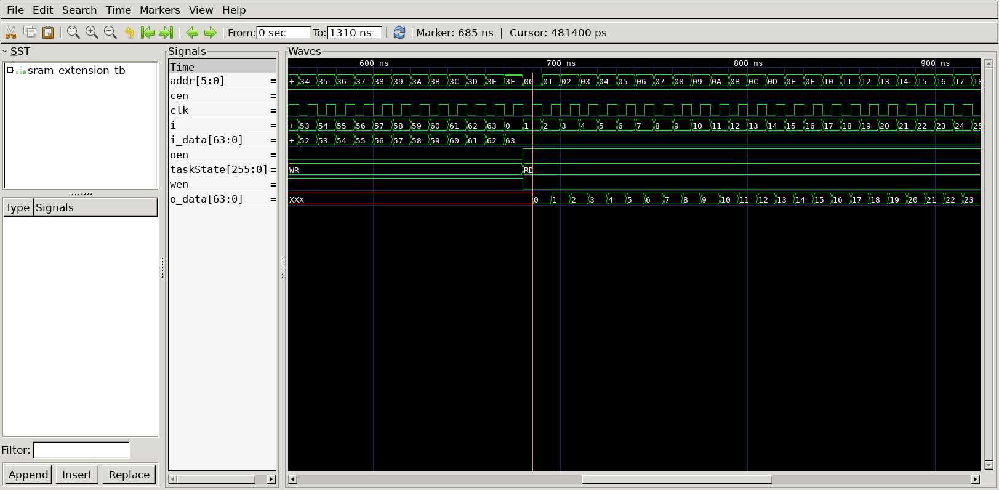

# SRAM Extension
## Operation Principle
- Address & Data Bitwidth
	- SRAM Unit
		- 4 \-bit Addr. & 32 \-bit I\/O Data
	- Target
		- 6 \-bit Addr. & 64 \-bit I\/O Data

- Code Description
	- Adress : 00_0000 ~ 00_1111 i_data[31:0] + i_data[63:32]
	- Adress : 01_0000 ~ 01_1111 i_data[31:0] + i_data[63:32]
	- Adress : 10_0000 ~ 10_1111 i_data[31:0] + i_data[63:32]
	- Adress : 11_0000 ~ 11_1111 i_data[31:0] + i_data[63:32]

## Verilog Code
### DUT
```Verilog
module sram_extension
(
	input		  clk,
	input		  wen,
	input		  cen,
	input		  oen,
	input  [5:0]  addr,
	input  [63:0] i_data,
	output [63:0] o_data
);

	spsram
	#(
		.BW_DATA			(32					),
		.BW_ADDR			(4					)
	)
	u_spsram0(
		.clk				(clk				),
		.wen				(wen				),
		.cen				(~addr[5] & ~addr[4]),
		.oen				(~addr[5] & ~addr[4]),
		.addr				(addr[3:0]			),
		.i_data				(i_data[31:0]		),
		.o_data				(o_data[31:0]		)
	);

	spsram
	#(
		.BW_DATA			(32					),
		.BW_ADDR			(4					)
	)
	u_spsram1(
		.clk				(clk				),
		.wen				(wen				),
		.cen				(~addr[5] & ~addr[4]),
		.oen				(~addr[5] & ~addr[4]),
		.addr				(addr[3:0]			),
		.i_data				(i_data[63:32]		),
		.o_data				(o_data[63:32]		)
	);

	spsram
	#(
		.BW_DATA			(32					),
		.BW_ADDR			(4					)
	)
	u_spsram2(
		.clk				(clk				),
		.wen				(wen				),
		.cen				(~addr[5] & addr[4] ),
		.oen				(~addr[5] & addr[4] ),
		.addr				(addr[3:0]			),
		.i_data				(i_data[31:0]		),
		.o_data				(o_data[31:0]		)
	);

	spsram
	#(
		.BW_DATA			(32					),
		.BW_ADDR			(4					)
	)
	u_spsram3(
		.clk				(clk				),
		.wen				(wen				),
		.cen				(~addr[5] & addr[4] ),
		.oen				(~addr[5] & addr[4] ),
		.addr				(addr[3:0]			),
		.i_data				(i_data[63:32]		),
		.o_data				(o_data[63:32]		)
	);

	spsram
	#(
		.BW_DATA			(32					),
		.BW_ADDR			(4					)
	)
	u_spsram4(
		.clk				(clk				),
		.wen				(wen				),
		.cen				(addr[5] & ~addr[4] ),
		.oen				(addr[5] & ~addr[4] ),
		.addr				(addr[3:0]			),
		.i_data				(i_data[31:0]		),
		.o_data				(o_data[31:0]		)
	);

	spsram
	#(
		.BW_DATA			(32					),
		.BW_ADDR			(4					)
	)
	u_spsram5(
		.clk				(clk				),
		.wen				(wen				),
		.cen				(addr[5] & ~addr[4] ),
		.oen				(addr[5] & ~addr[4] ),
		.addr				(addr[3:0]			),
		.i_data				(i_data[63:32]		),
		.o_data				(o_data[63:32]		)
	);

	spsram
	#(
		.BW_DATA			(32					),
		.BW_ADDR			(4					)
	)
	u_spsram6(
		.clk				(clk				),
		.wen				(wen				),
		.cen				(addr[5] & addr[4]  ),
		.oen				(addr[5] & addr[4]  ),
		.addr				(addr[3:0]			),
		.i_data				(i_data[31:0]		),
		.o_data				(o_data[31:0]		)
	);

	spsram
	#(
		.BW_DATA			(32					),
		.BW_ADDR			(4					)
	)
	u_spsram7(
		.clk				(clk				),
		.wen				(wen				),
		.cen				(addr[5] & addr[4]  ),
		.oen				(addr[5] & addr[4]  ),
		.addr				(addr[3:0]			),
		.i_data				(i_data[63:32]		),
		.o_data				(o_data[63:32]		)
	);
endmodule

module spsram
#(
	parameter	BW_DATA = 32,
	parameter	BW_ADDR = 4
)
(
	input				 clk,
	input				 wen,
	input				 cen,
	input				 oen,
	input  [BW_ADDR-1:0] addr,
	input  [BW_DATA-1:0] i_data,
	output [BW_DATA-1:0] o_data
);

	// Memory Write
	reg		[BW_DATA-1:0]	mem[0:2**BW_ADDR-1];

	always @ (posedge clk) begin
		if(cen && wen)
			mem[addr] <= i_data;
		else
			mem[addr] <= mem[addr];
	end

	// Memory Read
	`ifdef	SPSRAM_ASYNC
		assign o_data = !oen ? 'bz :
						(cen && !wen) ? mem[addr] : 'bx;
	`else //sync
		reg		[BW_DATA-1:0] o_data;
		always @ (posedge clk) begin
			if(oen) begin
				if(cen && !wen)
					o_data <= mem[addr];
				else
					o_data <= 'bx;
			end
			else
				o_data <= 'bz;
		end
	`endif
endmodule
```

### Testbench
```Verilog
// --------------------------------------------------
//	Define Global Variables
// --------------------------------------------------
`define	CLKFREQ		100		// Clock Freq. (Unit: MHz)
`define	SIMCYCLE	`NVEC	// Sim. Cycles
`define NVEC		64		// # of Test Vector

// --------------------------------------------------
//	Includes
// --------------------------------------------------
`include	"sram_extension.v"

module sram_extension_tb;
// --------------------------------------------------
//	DUT Signals & Instantiate
// --------------------------------------------------
	reg		 	clk;
	reg		 	wen;
	reg		    cen;
	reg		 	oen;
	reg  [5:0]  addr;
	reg  [63:0] i_data;
	wire [63:0] o_data;

	sram_extension
	u_sram_extension(
		.clk				(clk				),
		.wen				(wen				),
		.cen				(cen				),
		.oen				(oen				),
		.addr				(addr				),
		.i_data				(i_data				),
		.o_data				(o_data				)
	);

// --------------------------------------------------
//	Tasks
// --------------------------------------------------
	reg [8*32-1:0] taskState;

	task init;
		begin
			taskState = "Init";
			clk = 0;
			wen = 0;
			cen = 0;
			oen = 0;
			addr = 0;
			i_data = 0;
		end
	endtask

	task memWR;
		input	[5:0] t_addr;
		input	[63:0] t_data;
		begin
			@(negedge clk) begin
				taskState = "WR";
				i_data = t_data;
				addr = t_addr;
				cen	 = 1;
				wen  = 1;
				oen  = 0;
			end
		end
	endtask

	task memRD;
		input	[5:0] t_addr;
		begin
			@(negedge clk) begin
				taskState = "RD";
				addr = t_addr;
				cen = 1;
				wen = 0;
				oen = 1;
			end
		end
	endtask

	always #(500/`CLKFREQ) clk = ~clk;

// --------------------------------------------------
//	Test Stimulus
// --------------------------------------------------
	integer		i, j;
	initial begin
		init();
		#(4*1000/`CLKFREQ);

		for (i=0; i<`SIMCYCLE; i++) begin
			memWR(i, i);
		end
		for (i=0; i<`SIMCYCLE; i++) begin
			memRD(i);
		end
		$finish;
	end

// --------------------------------------------------
//	Dump VCD
// --------------------------------------------------
	reg	[8*32-1:0]	vcd_file;
	initial begin
		if ($value$plusargs("vcd_file=%s", vcd_file)) begin
			$dumpfile(vcd_file);
			$dumpvars;
		end else begin
			$dumpfile("sram_extension_tb.vcd");
			$dumpvars;
		end
	end

endmodule
```

## Simulation Result
- Clock Period = 10ns
- When taskState is RD, o_data = i (0 ~ 63)
- Memory Read -> synchronous 


